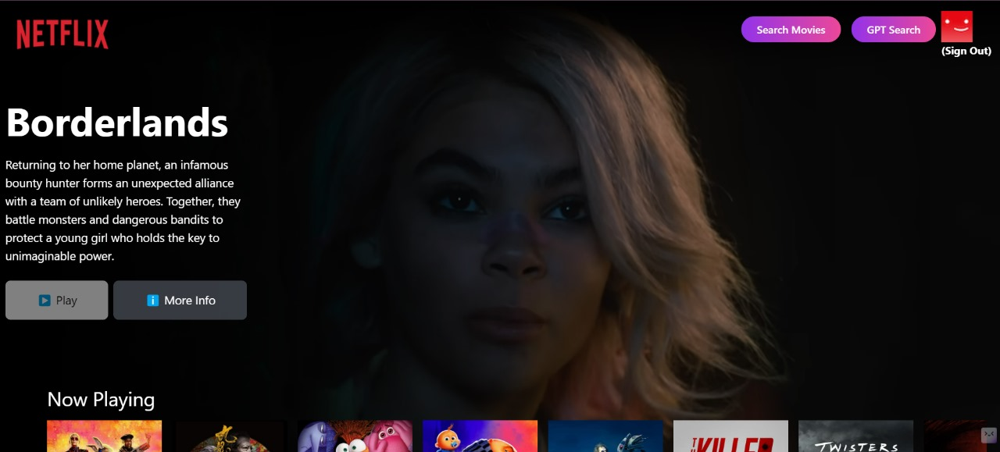

# 🎬 **MovieMind - A Netflix-like Movie App**

MovieMind is an immersive and dynamic movie exploration platform with a Netflix-inspired user interface. It offers features such as user authentication, multilingual support, genre-based search, and detailed movie information—all packed in a visually captivating design.

## 🚀 **Features**

### 1. **User Authentication**
- Secure user login and sign-up with Firebase.
- Personalized movie recommendations based on user preferences.

### 2. **Netflix-like User Interface**
- A seamless and visually rich interface similar to Netflix.
- A trailer of the latest release plays continuously in the background to enhance the user experience.

### 3. **Movie Categories**
- Browse through various categories such as:
  - 🎥 **Now Playing**
  - ⭐ **Top Rated**
  - 🔥 **Popular**
  - 🎬 **Upcoming**
- Scrollable cards for easy navigation, showing movie posters and essential information.

### 4. **Movie Details Page**
- Clicking on any movie card reveals a dedicated detail page.
- View essential movie details such as the plot, runtime, cast, release date, and more.

### 5. **Multilingual Support**
- Search movies in multiple languages, making the platform accessible to users worldwide.

### 6. **Advanced Movie Search with Gemini**
- Integrated **Gemini** to enhance search functionality.
- Genre-based search: Users can search movies by genre like "horror action movies."
- Title search: Search movies by name, such as "Dilwale Dulhania Le Jayenge."
- Results are displayed as scrollable cards, and clicking on a movie shows the full details.

## 🛠️ **Tech Stack**

### Frontend
- **React (Vite):** Blazing-fast user interface with modern JavaScript framework.
- **Redux:** Efficient state management.
- **Tailwind CSS:** Utility-first CSS framework for seamless styling.

### Backend
- **Firebase:** For authentication and user management.
- **TMDb API:** To fetch the latest movies, TV shows, and series information.

### Other Integrations
- **Gemini:** For advanced search functionalities.

## 🎨 **UI Preview**

<p align="center">
   
</p>

## 🔧 **Setup and Installation**

1. **Clone the repository:**

   ```bash
   git clone https://github.com/PragyanPrakhar/MovieMind.git
   cd MovieMind

2. **Install dependencies:**
    ```bash
    npm install

3. **Set up environment variables:**
-  Create a .env file at the root of your project and add your Firebase and TMDb API keys:

    ```bash
    REACT_APP_FIREBASE_API_KEY=your_firebase_api_key
    REACT_APP_TMDB_API_KEY=your_tmdb_api_key

4. **Run the application:**
   ```bash
    npm run dev

## **🎥 Demo
Check out the live demo of MovieMind at: https://movie-mind-iota.vercel.app/


